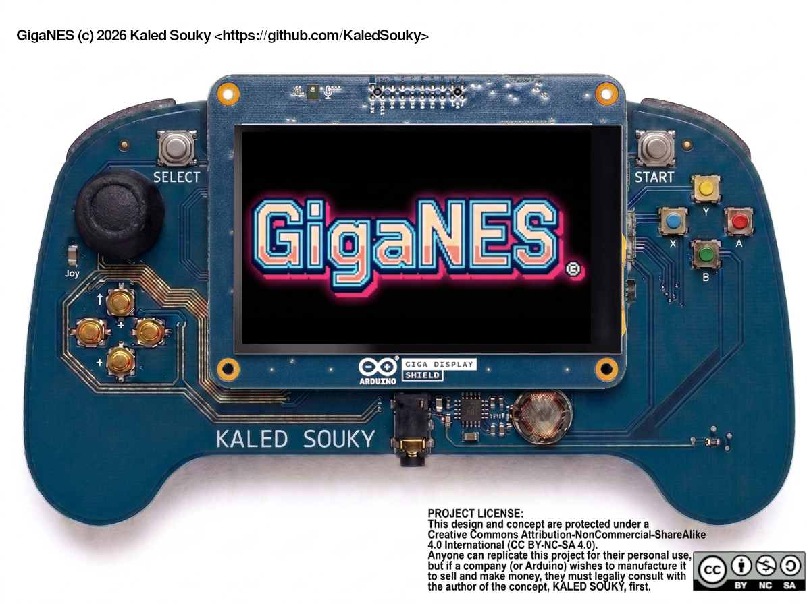
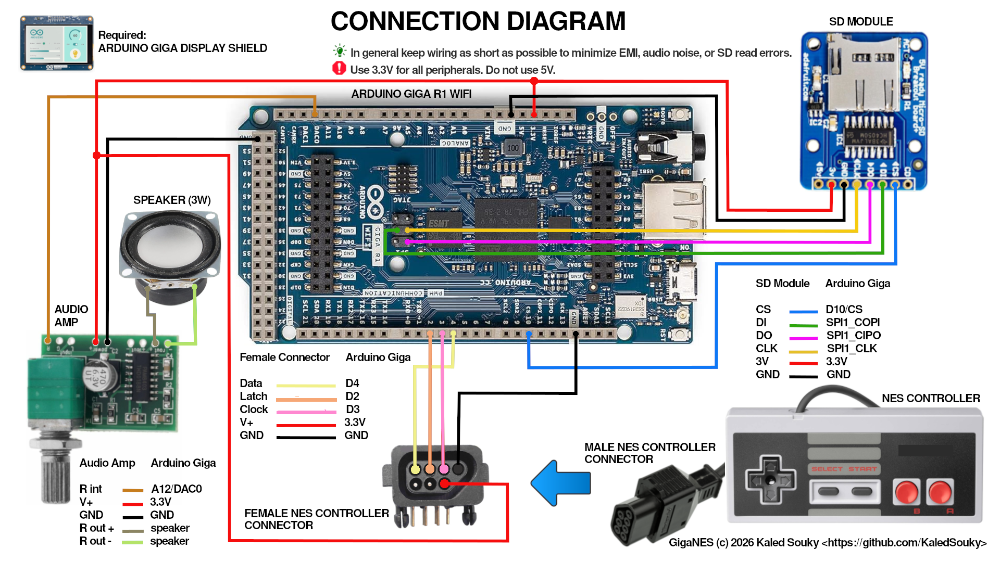

  

  

# GigaNES: High-Performance NES :mushroom: Emulator for Arduino Giga 

Copyright (c) 2026 Kaled Souky. All rights reserved.

This program is free software: you can redistribute it and/or modify it under the terms of the GNU General Public License as published by the Free Software Foundation, either version 3 of the License, or (at your option) any later version.

This program is distributed in the hope that it will be useful, but WITHOUT ANY WARRANTY; without even the implied warranty of MERCHANTABILITY or FITNESS FOR A PARTICULAR PURPOSE. See the GNU General Public [License](LICENSE) for more details.

---

**GigaNES** (developed by **Kaled Souky** in 2026) is a specialized port of the **Nofrendo** NES emulator core, custom-engineered for the [Arduino Giga R1 WiFi](https://store-usa.arduino.cc/collections/giga/products/giga-r1-wifi) ([STM32H747XI](https://www.st.com/en/microcontrollers-microprocessors/stm32h747xi.html)) and the [Arduino Giga Display Shield](https://store-usa.arduino.cc/collections/giga/products/giga-display-shield). This project leverages the high-speed **Cortex-M7** core and low-level STM32 register access to deliver a full-speed, low-latency gaming experience on modern Arduino hardware.

In the field of emulation, the [STM32H747XI](https://www.st.com/en/microcontrollers-microprocessors/stm32h747xi.html) delivers disruptive performance. Although it is a dual-core SoC, its **480 MHz Cortex-M7** core is the true standout: thanks to its **superscalar architecture** and **zero-latency Tightly Coupled Memory (TCM)**, it processes video layers and transparencies with a fluidity that popular alternatives simply cannot match. While the **ESP32** (Xtensa at 240 MHz) or the **RP2040/RP2350** (Cortex-M0+/M33 at 150 MHz) often encounter data access bottlenecks, this chip ensures consistent **60Hz (NTSC)** emulation, high-fidelity audio via its **12-bit DAC**, and imperceptible input lag. This undoubtedly positions this project as the most advanced and powerful NES emulator ever developed for the **Arduino ecosystem**.

Unlike typical portable emulation projects based on Single-Board Computers (SBCs) like the Raspberry Pi 5 or Orange Pi, **GigaNES operates entirely on bare-metal hardware**. While high-performance MPUs rely on a complex Linux operating system layer—which introduces multi-threaded scheduling overhead, driver abstraction, and unpredictable input lag (ranging from 15 to 50 ms)—this project achieves a **near-zero latency (< 1 ms)** gaming experience. By avoiding the heavy overhead of an OS kernel, the Cortex-M7 core samples controller inputs through direct low-level register access in a deterministic manner. Furthermore, this MCU-centric design eliminates data corruption risks during sudden power-offs, boots instantly in under a second, and operates with extreme thermal efficiency, delivering a silent, fanless, and robust console experience that modern MPU-based alternatives cannot replicate.

  

  
 📽️ [Video on YouTube](   )

---

## 1. :woman_teacher: Technical Specifications: Architecture (v1.0)

### 1.1 Video System (High-Performance Blitter)
* **M7 Brute Force:** Due to hardware DMA2D limitations for simultaneous rotation and scaling, the Cortex-M7 core is utilized to perform a high-speed software transformation, bypassing standard HAL overhead.
* **Rotation & Scaling Architecture:** Adapts the native NES output (256×240) to the MIPI DSI panel (native Portrait 480×800) to achieve a **true Landscape orientation**:
    * **Short Axis:** The scaled NES height (240×2 = 480) perfectly matches the display's native width.
    * **Long Axis:** The scaled NES width (256×2 = 512) is centered on the 800px long axis.
* **Bus Optimization (64-bit Writes):** To maximize throughput on the memory bus, the system utilizes `uint64_t` pointers to transfer 4 pixels (16-bit each) per single bus operation.
* **Loop Unrolling (8x):** The critical blitter loop is unrolled 8 times to minimize branch overhead, achieving consistent **Blit times of ~6.0ms** (consuming only 36% of the total frame time budget).

### 1.2 Audio System (High-Fidelity Design)
* **Sampling Rate (44100 Hz):** Set to the CD-quality standard to ensure maximum sound accuracy. This frequency captures the full harmonic spectrum of the NES APU and specialized expansion chips (like the VRC6), providing a rich and authentic auditory experience.
* **DAC Output:** Utilizes the **Advanced DAC** (DAC0 / Pin A12) integrated into the STM32H7. The system performs precise dynamic mapping from 16-bit signed emulation samples to the 12-bit unsigned hardware output of the peripheral.
* **Stability & Buffer:** Implements a circular buffer with an **x8 DMA queue depth**. This specific "sweet spot" balance ensures crisp, glitch-free audio without "popping" or latency issues, even during intensive CPU cycles.

### 1.3 Memory Management (Hybrid Hierarchy)
* **DTCMRAM (128 KB):** Zero-latency memory directly coupled to the core. Hosts the `emu_buf` (256x240) and `hw_palette`, eliminating CPU wait states during the scaling process.
* **Internal SRAM:** Stores executable code and critical emulator state variables.
* **External SDRAM (8 MB):** Managed by the FMC (Flexible Memory Controller) for the screen's Double Framebuffer and PRG/CHR ROM bank storage.

### 1.4 Input Management (Low-Latency NES Controllers)
* **Direct Register Access:** Bypasses Arduino's `digitalWrite`/`digitalRead` functions for the original NES controller interface.
* **Atomic Manipulation:** Utilizes the **BSRR** (Bit Set/Reset Register) for *Latch* and *Clock* lines, ensuring state changes in a single clock cycle.
* **Instant Capture:** Data line reading is performed via the **IDR** (Input Data Register), eliminating input lag and providing a response identical to the original hardware.

### 1.5 Storage & SD (Asynchronous Persistence System)
* **Library:** **SdFat** in `DEDICATED_SPI` mode (50 MHz) for maximum I/O speed.
* **Auto-Save Engine:** Emulates the original battery-backed RAM (SRAM) behavior by monitoring writes in the `$6000-$7FFF` range. This ensures that "natural" game progress is automatically preserved.
* **Zero-Jitter SaveThread:** An independent RTOS thread manages the creation and updating of **`.sav`** files in the background. By using a shadow buffer, it ensures that saving does not impact emulation fluidity, eliminating any stuttering or frame drops.

### 1.6 Dynamic Region Detection
* **Header Parsing:** The system analyzes iNES flags to automatically detect NTSC or PAL formats.
* **Hardware Synchronization:** Dynamically adjusts the MIPI controller **Pixel Clock** (23.7 MHz for PAL / 28.4 MHz for NTSC) and scanline count, maintaining correct game speed without display resets.

### 1.7 DMA & Dedicated Hardware Utilization
* **Video:** The LTDC/DSI controller utilizes hardware DMA to read the framebuffer from SDRAM autonomously.
* **Audio:** The DAC uses internal timers for output cadence, freeing the CPU from the precise timing of audio samples.

---

## 2. :man_technologist: Software Requirements

In your Arduino IDE, you must have the following packages and libraries installed; if you do not have them, install them using the [Boards Manager](https://docs.arduino.cc/software/ide-v2/tutorials/ide-v2-board-manager/) and [Library Manager](https://docs.arduino.cc/software/ide-v2/tutorials/ide-v2-installing-a-library/):
1. **The Arduino Mbed OS Giga Board Package**
1. **Arduino_H7_Video** (Included in the Arduino Mbed OS Giga Board Package)
2. [Arduino_GigaDisplay](https://github.com/arduino-libraries/Arduino_GigaDisplay)
3. [Arduino_AdvancedAnalog](https://github.com/arduino-libraries/Arduino_AdvancedAnalog)
4. [SdFat](https://github.com/greiman/SdFat)
5. **SDRAM** (Included in the Arduino Mbed OS Giga Board Package)

---

## 3. :woman_mechanic: Hardware Implementation Details 

  

### 3.1 :loud_sound: Audio & Amplification
The connection diagram features a **PAM8403** digital stereo amplifier module. Since the emulator generates a **monophonic signal**, only the **Right Channel** is used (Input: DAC0/Pin 12 | Output: 3W Speaker). You may use any monophonic (preferred) or stereo amplifier module, provided it operates at **3.3V** and offers good noise protection.

> [!CAUTION]
> If using a stereo module, **do not bridge** the Left and Right inputs or outputs to achieve "dual mono" sound. This unnecessarily increases current consumption and may exceed your power supply's capacity, leading to instability or hardware damage.

> [!TIP]
> If you experience audio noise, it is highly recommended to place a **470 µF (10V) electrolytic capacitor** and a **1 nF ceramic capacitor** in parallel across the power pins (V+ and GND), as close to the module as possible.

### 3.2 :video_game: NES Controllers (Single & Multiplayer)
For a single-player setup, follow the connections shown in [Connection_Diagram.png](/docs/Connection_Diagram.png). For multiplayer mode, use the following wiring:

| Signal | Arduino Giga Pin | Connection |
| :--- | :--- | :--- |
| **LATCH** | Pin 2 | Connect to LATCH on **BOTH** controllers |
| **CLOCK** | Pin 3 | Connect to CLOCK on **BOTH** controllers |
| **DATA 1** | Pin 4 | Connect to DATA on **Controller 1 ONLY** |
| **DATA 2** | Pin 5 | Connect to DATA on **Controller 2 ONLY** |

### 3.3 :floppy_disk: MicroSD Card Module & Preparation
This project is tested with the [Adafruit MicroSD card breakout board+](https://www.adafruit.com/product/254). Any alternative module must be compatible with **3.3V** logic.

* **Format:** The SD card (up to 32 GB) **MUST** be formatted in **FAT32**.
* **Filenames:** Use the **8.3 filename rule** (8 characters or less + `.nes` extension). Place all ROMs in the **root directory**.
* **Logic Levels:** If using a different module, ensure it has a built-in logic level shifter or is designed for 3.3V operation to match the Arduino Giga's I/O voltage.

### 3.4 :rotating_light: General Safety & Signal Integrity

> [!CAUTION]
> **Operating Voltage:** All peripherals must be powered with **3.3V**. Do **NOT** use 5V, as it will damage the Arduino Giga R1.

> [!TIP]
> **Wiring:** Use **short wires** for all connections (SD, Audio, and NES) to prevent electromagnetic interference (EMI), audio noise, or SD read errors.

---

## 4. :rocket: Usage Instructions

GigaNES is structured as a standard **Arduino Sketch**:

1. **Download** or clone the `GigaNES` folder.
2. **Open** `GigaNES.ino` in the Arduino IDE.
3. **Board Configuration:** Ensure you have the Arduino Giga R1 board package installed (**Tools > Board > Arduino Mbed OS Giga Boards**) and select **Arduino Giga R1**.
4. **Hardware Assembly:** Connect the **Arduino Giga R1 WiFi** to the **Giga Display Shield** and follow [Connection_Diagram.png](/docs/Connection_Diagram.png) for hardware peripherals. Refer to [Section 3](#3-woman_mechanic-hardware-implementation-details) for critical safety and wiring notes.
5. Upload and enjoy!

---

<b>GigaNES (c) 2026 Kaled Souky</b>

  

Support me on Ko-fi

